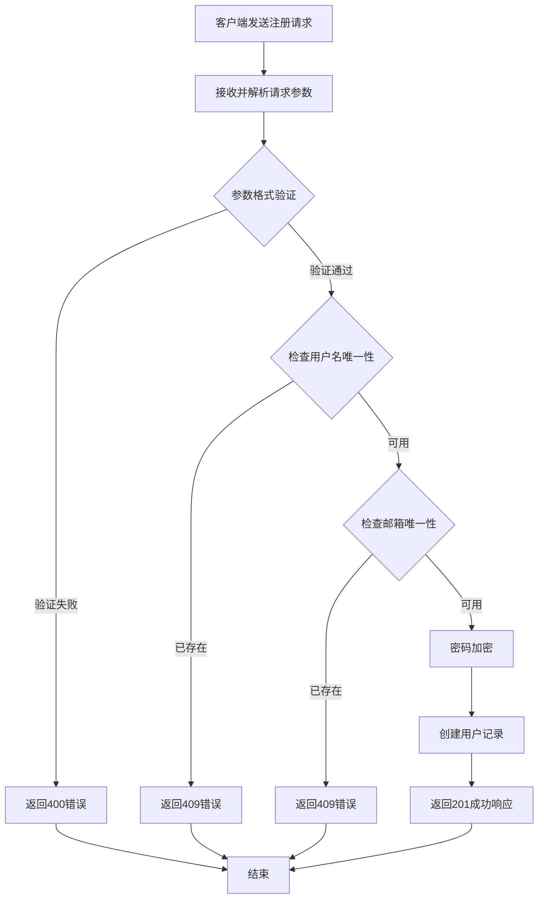

# 产品需求文档 (PRD) - Go用户服务

## 1. 产品概述

Go用户服务是一个基于Go语言和Gin框架构建的用户管理后端服务，提供用户注册、认证等核心功能。本文档聚焦于**用户注册**功能的详细需求定义。

---

## 2. 核心功能

### 2.1 功能模块

用户注册功能包含以下核心模块：

1. **用户注册接口**：接收用户注册请求，验证输入数据，创建用户账户
2. **数据验证模块**：对用户输入的用户名、邮箱、密码进行格式和唯一性验证
3. **密码加密模块**：对密码进行安全加密存储
4. **响应处理模块**：返回标准化的成功/失败响应

### 2.2 页面/接口详情

| 模块名称 | 功能描述 |
|---------|---------|
| 用户注册接口 | 接收POST请求，处理用户注册逻辑，返回注册结果 |
| 输入验证 | 验证用户名、邮箱、密码的格式和唯一性 |
| 密码加密 | 使用bcrypt等算法对密码进行加密存储 |
| 响应封装 | 统一的成功/错误响应格式 |

---

## 3. 核心流程

### 3.1 用户注册流程

1. 客户端发送注册请求（包含用户名、邮箱、密码）
2. 服务端接收请求并解析参数
3. 对输入数据进行格式验证
4. 检查用户名和邮箱的唯一性
5. 对密码进行加密处理
6. 将用户数据写入数据库
7. 返回注册成功响应（包含用户基本信息）

### 3.2 流程图



---

## 4. API接口定义

### 4.1 用户注册接口

**接口地址**: `POST /api/v1/auth/register`

**请求头**:
```
Content-Type: application/json
```

**请求参数**:

| 参数名 | 类型 | 必填 | 描述 |
|-------|------|------|------|
| username | string | 是 | 用户名，3-20个字符，唯一 |
| email | string | 是 | 邮箱地址，需符合邮箱格式，唯一 |
| password | string | 是 | 密码，6-20个字符，至少包含1个字母和1个数字 |

**请求示例**:
```json
{
  "username": "john_doe",
  "email": "john@example.com",
  "password": "abc123"
}
```

**成功响应 (201 Created)**:

| 字段 | 类型 | 描述 |
|-----|------|------|
| code | int | 状态码，成功为0 |
| message | string | 提示信息 |
| data | object | 用户数据 |
| data.id | string | 用户唯一标识 |
| data.username | string | 用户名 |
| data.email | string | 邮箱地址 |
| data.created_at | string | 创建时间，ISO 8601格式 |

**成功响应示例**:
```json
{
  "code": 0,
  "message": "注册成功",
  "data": {
    "id": "550e8400-e29b-41d4-a716-446655440000",
    "username": "john_doe",
    "email": "john@example.com",
    "created_at": "2024-01-15T08:30:00Z"
  }
}
```

**错误响应**:

| HTTP状态码 | 错误码 | 描述 |
|-----------|--------|------|
| 400 | 1001 | 请求参数错误（格式验证失败） |
| 400 | 1002 | 用户名格式无效（长度或字符限制） |
| 400 | 1003 | 邮箱格式无效 |
| 400 | 1004 | 密码格式无效（长度或复杂度不足） |
| 409 | 2001 | 用户名已存在 |
| 409 | 2002 | 邮箱已存在 |
| 500 | 3001 | 服务器内部错误 |

**错误响应示例**:
```json
{
  "code": 1001,
  "message": "请求参数错误：username不能为空"
}
```

```json
{
  "code": 2001,
  "message": "用户名已存在"
}
```

---

## 5. 业务规则

### 5.1 用户名规则

- **长度限制**: 3-20个字符
- **字符类型**: 支持字母、数字、下划线(_)、连字符(-)
- **唯一性**: 全局唯一，不区分大小写（存储时统一小写）
- **保留字**: 禁止使用系统保留字（如admin, root, system等）

### 5.2 邮箱规则

- **格式验证**: 必须符合标准邮箱格式（RFC 5322）
- **唯一性**: 全局唯一，不区分大小写（存储时统一小写）
- **格式示例**: `user@example.com`

### 5.3 密码规则

- **长度限制**: 6-20个字符
- **复杂度要求**: 
  - 至少包含1个英文字母（a-z, A-Z）
  - 至少包含1个数字（0-9）
- **加密存储**: 使用bcrypt算法进行单向加密，cost factor >= 10
- **传输安全**: 建议通过HTTPS传输

### 5.4 数据存储规则

- 用户ID使用UUID v4格式
- 创建时间使用UTC时间戳存储
- 密码哈希值单独存储，不与用户信息一起返回

---

## 6. 错误处理

### 6.1 错误分类

| 错误类型 | 说明 | 处理方式 |
|---------|------|---------|
| 参数验证错误 | 请求参数格式不符合要求 | 返回400状态码，具体错误信息 |
| 资源冲突错误 | 用户名或邮箱已存在 | 返回409状态码，提示冲突字段 |
| 服务器错误 | 数据库连接、加密等内部错误 | 返回500状态码，记录日志 |

### 6.2 错误响应格式

所有错误响应统一使用以下格式：

```json
{
  "code": <错误码>,
  "message": "<错误描述>"
}
```

### 6.3 错误码定义

| 错误码 | 含义 | HTTP状态码 |
|-------|------|-----------|
| 0 | 成功 | 200/201 |
| 1001 | 请求参数错误 | 400 |
| 1002 | 用户名格式无效 | 400 |
| 1003 | 邮箱格式无效 | 400 |
| 1004 | 密码格式无效 | 400 |
| 2001 | 用户名已存在 | 409 |
| 2002 | 邮箱已存在 | 409 |
| 3001 | 服务器内部错误 | 500 |

---

## 7. 接口设计规范

### 7.1 路径规范

- 基础路径: `/api/v1`
- 认证相关: `/api/v1/auth/*`
- 用户相关: `/api/v1/users/*`

### 7.2 响应规范

- 成功响应HTTP状态码: 200 (GET/PUT) / 201 (POST) / 204 (DELETE)
- 错误响应HTTP状态码: 400 / 401 / 403 / 404 / 409 / 500
- 响应Content-Type: `application/json; charset=utf-8`

### 7.3 时间格式

- 所有时间字段使用ISO 8601格式: `YYYY-MM-DDTHH:mm:ssZ`
- 时区统一使用UTC

---

## 8. 安全要求

1. **HTTPS传输**: 所有API请求必须通过HTTPS传输
2. **密码加密**: 使用bcrypt进行密码哈希，禁止明文存储
3. **输入过滤**: 对所有输入参数进行XSS和SQL注入防护
4. **速率限制**: 对注册接口进行频率限制（如每IP每分钟最多5次）

---

## 9. 实现目录

```
internal/
├── handler/
│   └── auth_handler.go      # 认证相关handler，包含注册接口
├── service/
│   └── auth_service.go      # 认证相关业务逻辑
├── repository/
│   └── user_repository.go   # 用户数据访问层
├── model/
│   └── user.go              # 用户模型定义
├── dto/
│   └── auth_dto.go          # 请求/响应DTO定义
└── validator/
    └── validator.go         # 自定义验证器
```

---

## 10. 附录

### 10.1 正则表达式参考

| 字段 | 正则表达式 |
|-----|-----------|
| 用户名 | `^[a-zA-Z0-9_-]{3,20}$` |
| 邮箱 | `^[a-zA-Z0-9._%+-]+@[a-zA-Z0-9.-]+\.[a-zA-Z]{2,}$` |
| 密码 | `^(?=.*[A-Za-z])(?=.*\d)[A-Za-z\d@$!%*#?&]{6,20}$` |

### 10.2 相关文档

- [Gin框架文档](https://gin-gonic.com/docs/)
- [bcrypt加密文档](https://pkg.go.dev/golang.org/x/crypto/bcrypt)
- [Go Validator](https://github.com/go-playground/validator